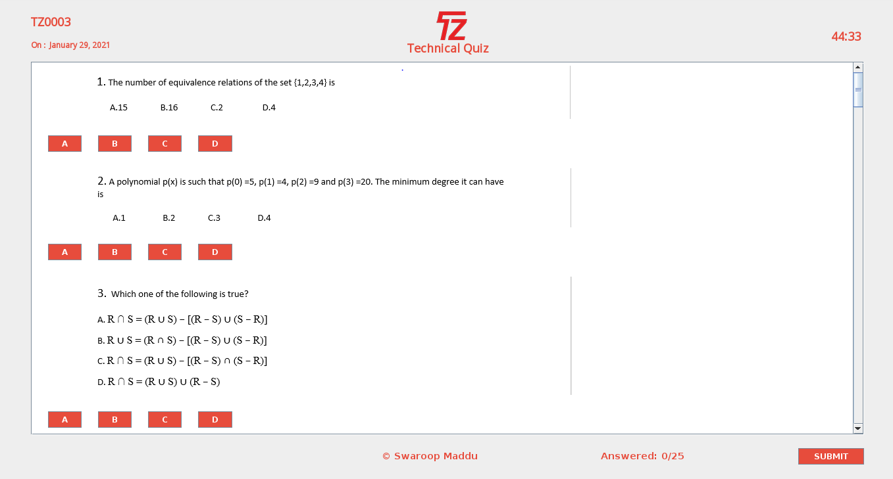

# Examiner

   Examiner is an online Examination System developed for educational institutes to conduct MCQ's test for their students on regular basis. As far as design is concerned no design is complete ever and there are chances of improvement at each moment. However performing all the necessary testing, we will conclude that our design will implement properly that it absolutely was made.
   
# Project Objective

   * Online Examination System can reduce the hectic job of assessing the answers given by candidates manually.
   * Responses or the answers by the candidates can be checked automatically and instantly.
   * It will reduce paper work to be an integrated Online Examination System.
   * The result can be shown immediately to the students reducing the anxiety.
   * Can create various reports and graphs for evaluation purpose almost instantly when and where required.
   

# Examiner System Features

  * Secure
  * Time bar prevention
  * Straightforward to use
  * Reliable
  * No need of examiner
  * Consistency
  
# Demo
   
   
Online Examination System is developed or designed for educational institutes like colleges and institutes to conduct MCQ's test for their students on regular basis to atomate the process of paper based correction and decreare time for results.

   
Designed to provide clean user interface.

   
Complete and safe.

   
Can be used anywhere anytime.

   
   [Demo](https://swaroopmaddu.github.io/examiner)

